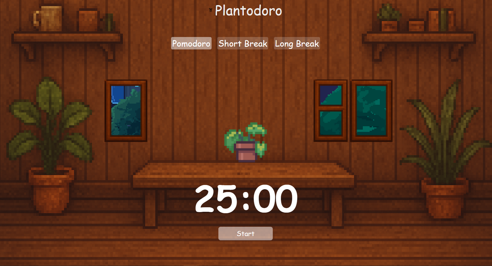

# Plantodoro 🌱

Plantodoro is a minimalist focus timer inspired by Pomofocus.  
Work in short, focused intervals using the Pomodoro Technique.  




---

## Features

1. **Focused Intervals** – Work in short, timed sessions for maximum productivity.  
2. **Short & Long Breaks** – Take short and long breaks to refresh your mind and stay balanced.  
3. **Progress Tracking (Planned)** – A virtual plant will grow as you complete Pomodoro cycles (coming soon!).  

---

## How to Use

1. Open Plantodoro in your browser.  
2. Set your desired Pomodoro time.  
3. Start your focused session and enjoy a distraction-free environment.  

---

## Tech Stack

- HTML, CSS, JavaScript  
- Next.js / React 

---

## How to Run Locally

1. Make sure you have **Node.js** installed: [https://nodejs.org](https://nodejs.org)  
2. Clone this repository:

```
npm install
```

```
npm run dev
```

```
http://localhost:3000
```

## License

This project is licensed under the MIT License.
